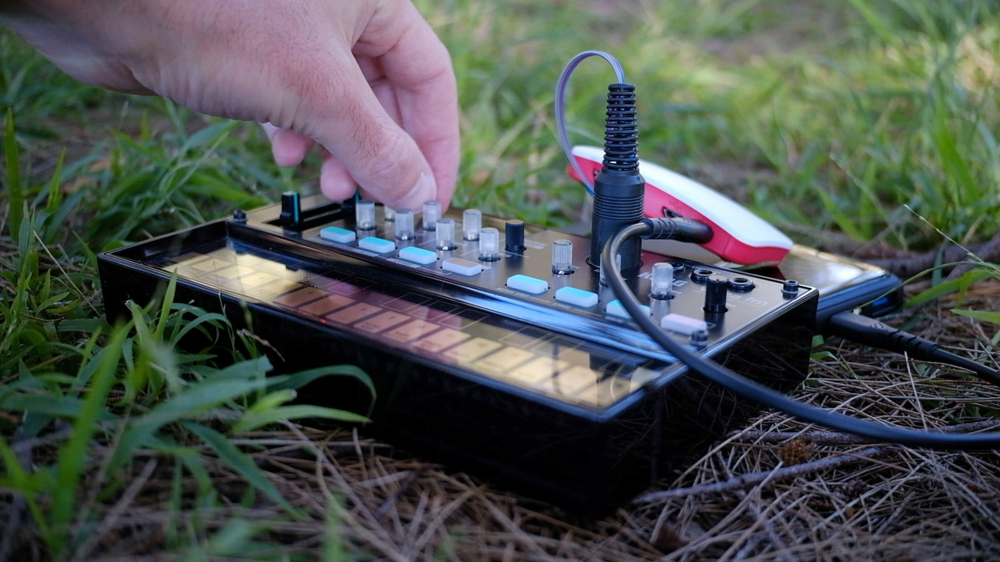
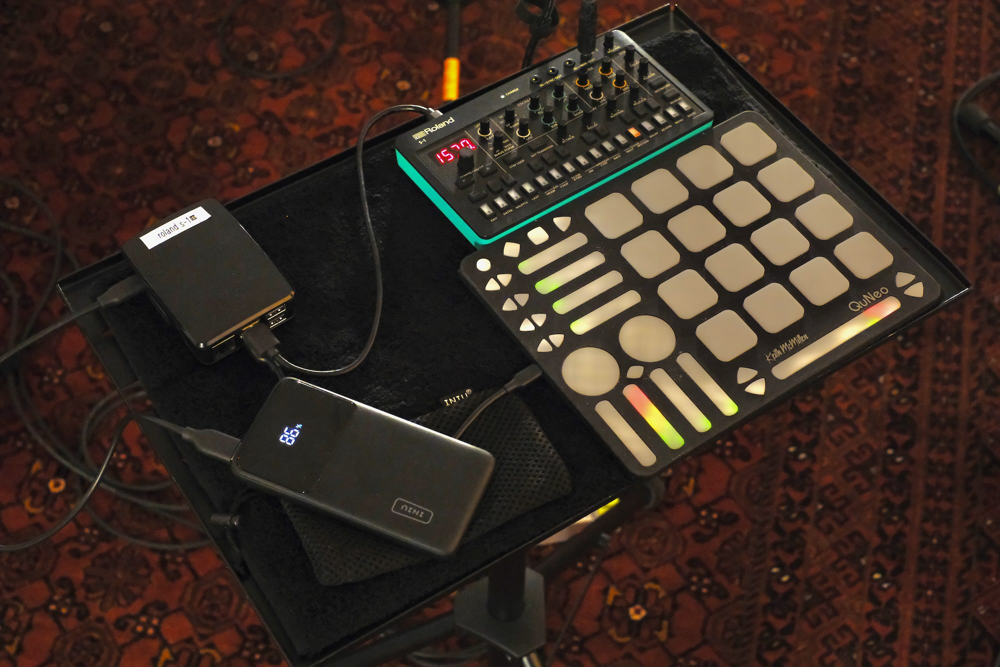

For the last two years I have been performing with a small generative AI system that runs on a Raspberry Pi and talks to my synthesisers over MIDI. I have used it in solo gigs, duos, group improvisations, and at an improvisation festival earlier this year. This post is a short version of a paper I will present at [NIME 2026](https://nime2026.org) in London in June.

## The system

The platform is called [IMPSY](https://github.com/cpmpercussion/impsy). The software is a Python program that runs a small mixture density recurrent neural network (MDRNN) and generates streams of MIDI data: notes and continuous controllers that go out to an external synth. It also listens to MIDI coming back, so it can react to what I am playing.

The whole system runs on a Raspberry Pi. The cheapest one I have used is the Zero 2 W, which costs around 15 USD. I flash a pre-built OS image onto an SD card, plug the Pi into a synthesiser, and it boots straight into the AI software. Configuration happens through a web interface in a browser.

I work with small models trained on data I collect myself by improvising. A typical model is two layers of 64 LSTM units, trained on a couple of hours of recordings in around half an hour on a laptop. These are tiny compared with industrial generative AI, but they are sufficient for producing musically useful data in real time on small hardware.

The question the paper asks is what changes about the design of intelligent musical instruments when AI is cheap, portable, and battery-powered enough to take to a gig.

## Why bother

There is plenty of generative AI for music now, but very little of it is built for performers. The available tools are mostly designed for prompting, production, or generating finished tracks. The few systems built for live performance with AI tend to be research one-offs tied to expensive hardware or large models trained on other people's data.

I wanted something I could prototype an instrument with in an afternoon, take to a gig that night, and keep iterating on for years. I also wanted the whole pipeline, from data collection through to deployment, to fit inside one person's musical practice.

## Five instruments

The paper documents five instruments built and performed with between 2024 and 2026.

### The Intelligent Volca

The first instrument was a Korg Volca FM (battery-powered, internal speaker) with a Raspberry Pi Zero connected by two resistors and a MIDI plug soldered to the GPIO header. The AI played notes; I adjusted the patch.

The interaction was one-way because the Volca FM has no MIDI output, so the AI could not hear me. The model had been trained on expressive interaction with a continuous controller, so it tended to play glissandi, which the Volca rendered as a stream of retriggered notes. After recording a demo video with the system, I felt that the AI model would be more useful for controlling synthesis parameters than for playing notes. The interesting work for the AI was in places where a human cannot easily go, like changing several knobs at once.

### The Intelligent MicroFreak and S-1

Next I moved to synthesisers with two-way MIDI: first an Arturia MicroFreak, then a Roland S-1. The AI controlled eight things in parallel (note-on messages plus seven timbral parameters) while listening to me doing the same on the synth's front panel. The interaction was call-and-response: when I played, the AI tracked; when I stopped for long enough, the AI took over.

This is where the system started to feel like a musical instrument. Unlike a human, the AI can adjust many parameters simultaneously, which results in an inhuman but exciting exploration of the synth parameter space. In non-AI performances, I would primarily play notes with occasional timbral changes; with the AI in the loop, the timbral parameters update between phrases and sometimes between notes, leading to varying and unusual sounds. To enhance this effect, I tried setting the call-and-response switch-over time to a very short 0.1 seconds.

### The Intelligent DAW

I then connected the Pi to a DAW running on an iPad: Kymatica AUM, with eight different sound generators routed through the AI's inputs and outputs. The same trained model could now control software synthesisers, samplers, and effects, all freely remappable inside AUM.

The lesson from this setup was about remapping rather than retraining. The same model, routed through different MIDI mappings in the DAW, becomes a different instrument. I could swap software synths in and out, or adjust them so they sounded significantly different, without modifying the AI system at all.

### The Intelligent Setup

The setup I am using now splits the interface across two devices: the Roland S-1 plus an external controller (first a Behringer X-Touch Mini, later a Keith McMillen QuNeo). The AI mediates between them. The S-1 makes the sound; the controller provides larger knobs, LED feedback, and pads for playing notes when I want to.

This was the setup I took to a three-day improvisation festival in January, where I used the same instrument across performances with acoustic players, acoustic players with electronic augmentations, and electronic musicians. The challenge in that environment is that the *vibe* of a particular set might be unknown in advance, ranging from sparse textures to a wall of noise. With visual feedback and a more flexible controller, that finally felt achievable.

## What I learned

Four findings came out of these two years.

The first is that re-mapping can replace retraining. Training a small model takes minutes; bigger models can take hours or days, and audio generation models can take longer still. Once I have a model that produces musically interesting data, I can keep finding new uses for it by changing what its outputs control. The trained model becomes a transportable design component, similar to a trusted effects pedal or filter module that moves between setups.

The second is that fast input interleaving is a new mode of co-creative performance. Most AI music systems use turn-taking or footswitch-driven listening modes. Pulling the human/AI switch-over time down to 0.1 seconds produces something different. The intelligent instrument feels like a continually changing device, like a free-running oscillator or feedback system, that the performer can guide and adjust but not fully control. It also helps with what Stefánsdóttir calls the "rescue" problem: if the AI is doing something I do not want, I just play, and I am back in charge.

The third is that small-data AI can be a serious design resource. One model, trained on my own improvisations, served as the brain for all five instruments. This challenges the assumption that generative AI necessarily requires industrial-scale datasets and unsustainable compute. For an individual artist working in their own practice, small data is enough, and the data-sourcing problems that come with larger models largely go away.

The fourth is that cheap hardware lowers the barrier to inclusion. A 15 USD computer that boots into a usable AI instrument makes it practical to dedicate Raspberry Pis to different setups, lend them to collaborators, or leave one installed inside an instrument. In my own gigs I tended to reach for a Raspberry Pi 4 or 5 because the boot and inference times are faster, but for the broader question of who gets to experiment with intelligent instruments, the cheaper option matters.

## What's next

This was first-person research. I built the instruments, performed with them, and reflected on what happened. The next step is to put the platform in other people's hands and see what they build with it that I would not. The model could also evolve over time as a performer's data accumulates, which is something I have not yet explored systematically.

If you want to try the system, the code and Raspberry Pi images are on GitHub:

- Software: <https://github.com/cpmpercussion/impsy>
- Pi OS images: <https://github.com/cpmpercussion/impsy-pi>

A video showing the instruments in action is here: <https://doi.org/10.5281/zenodo.19550146>

If you make something with it, I would like to hear about it.
